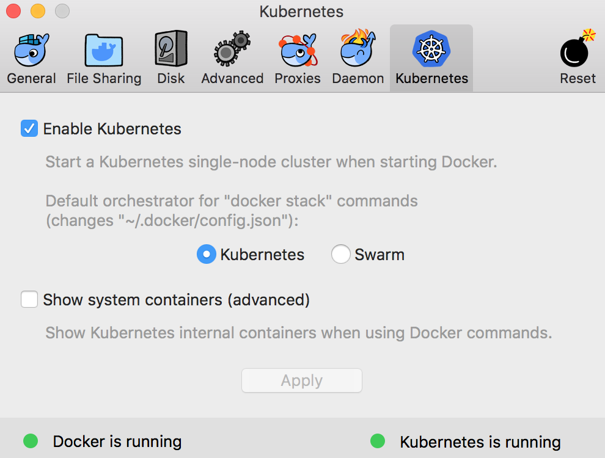

# simple-microservice

Backend is a gradle project using spring boot and java

Frontend is a angular cli project using angular 5 and bulma css

This project main purpose is to show how easy it is to deploy services on kubernetes

We will be using kubernetes locally provide with docker

## Prerequisetes

Install [docker](https://docs.docker.com/) and enable kubernetes through Preferences setting



Install [gradle](https://gradle.org/)
* MacOs Example: `> brew install gradle`

Install [node and npm] (https://nodejs.org/en/)
* MacOs Example: `> brew install node`


# Running projects

* Change directory into backend/frontend
* Run this file `./.run-docker.sh`
    * This file will create the docker image, deploy to a dockerhub account, create deployment & services in kubernetes environment, and then port forward your service to localhost:specified-port
    ```
    > cd backend
    > ./.run-docker.sh
    ```

* To see your pods running you can use the kuberentes dashboards
    * Run this your terminal to create the components needed for your dashboard
        ```
        > kubectl create -f https://raw.githubusercontent.com/kubernetes/dashboard/master/src/deploy/recommended/kubernetes-dashboard.yaml
        ```
    * Start the proxy for your dashboard
        ```
        > kubectl proxy http://localhost:6443/api/v1/namespaces/kube-system/services/https:kubernetes-dashboard:/proxy/
        ```  
    * To open your dashboard [click here](http://localhost:8001/api/v1/namespaces/kube-system/services/https:kubernetes-dashboard:/proxy/#!/overview?namespace=default)

    * With dashboard you can view or edit your pods, statefulsets, services, different namespaces, etc.
    


